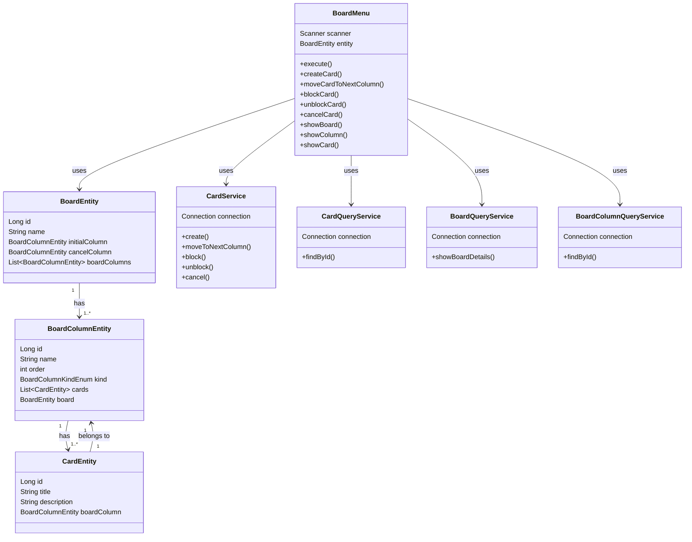

# 🗂️ Board Manager - Decola Tech
<p align="center">
  
</p>


Aplicação Java para gerenciamento de **boards no estilo Kanban**, construída como parte do projeto **Decola Tech** com ênfase em persistência de dados e organização de tarefas.

## 📋 Descrição

Este projeto é um sistema de linha de comando para gerenciamento de **quadros de tarefas (boards)** com funcionalidades como:

- Criação de boards personalizados com colunas nomeadas
- Cadastro, movimentação, bloqueio e cancelamento de **cards**
- Visualização de informações detalhadas por board, coluna ou card
- Persistência de dados em banco MySQL com **Liquibase**
- Arquitetura modular com `DAO`, `Service`, `Entity`, `DTO` e menus interativos

## 🚀 Funcionalidades

- [x] Criar um novo board com colunas personalizadas
- [x] Criar, mover e excluir cards
- [x] Bloquear/desbloquear cards com motivo
- [x] Cancelar cards para uma coluna de cancelamento
- [x] Visualizar informações do board completo
- [x] Consultar cards individualmente ou por coluna

## 🧱 Estrutura do Projeto

```bash
src/
├── main/
│   ├── java/br/com/dio/
│   │   ├── ui/                  # Menus interativos (MainMenu, BoardMenu)
│   │   ├── dto/                 # Objetos de transferência de dados
│   │   ├── service/             # Regras de negócio
│   │   ├── persistence/
│   │   │   ├── dao/             # Acesso ao banco de dados (JDBC)
│   │   │   ├── entity/          # Entidades do domínio
│   │   │   └── config/          # Configuração de conexão com o banco
│   └── resources/
│       ├── db/                  # Migrations Liquibase
│       └── liquibase.properties
```

## 🛠️ Tecnologias Utilizadas

- **Java 17**
- **Gradle 8.13**
- **Spring Boot (parcial)**
- **JDBC + DAO Pattern**
- **MySQL**
- **Liquibase** (controle de versões do banco de dados)
- **Lombok**
- **Dockerfile** para deploy
- **Railway** (opcional para deploy)

## 🧪 Como Executar Localmente

### Pré-requisitos

- Java 17
- MySQL (porta `3306`, banco `board`)
- Gradle
- Docker (opcional)

### Passos

```bash
# Clonar o repositório
git clone https://github.com/CaroliisRibeiro/bord-avanade-decola-tech.git
cd bord-avanade-decola-tech

# Criar banco de dados no MySQL
CREATE DATABASE board;

# Rodar as migrations com o Liquibase
./gradlew update

# Compilar e rodar o projeto
./gradlew clean build
java -jar build/libs/board-bd-decola-tech.jar
```

## 💻 Como Usar

O terminal exibirá um menu interativo:

```
1 - Criar um novo board
2 - Selecionar um board existente
3 - Excluir um board
4 - Sair
```

Cada board criado possui colunas que podem conter cards. Os cards podem ser movidos, bloqueados ou visualizados diretamente pelo menu.

## 🧩 Diagrama de Classes




## 🧠 Autor

Desenvolvido por **Caroliis Ribeiro** como parte da formação **Decola Tech da DIO** e estudos em desenvolvimento backend com Java.
